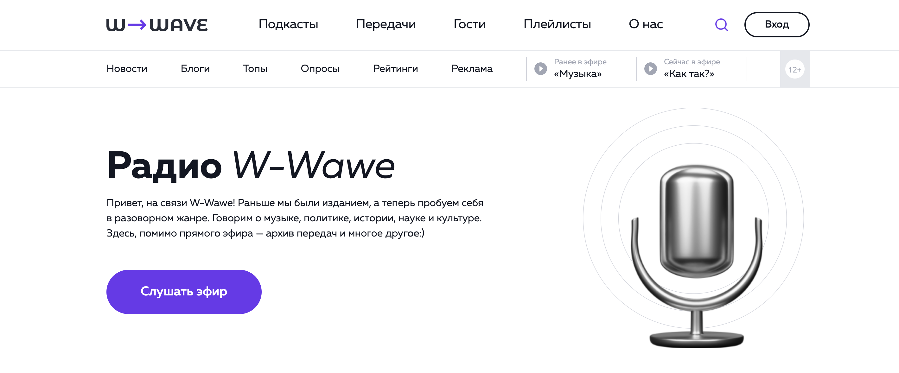
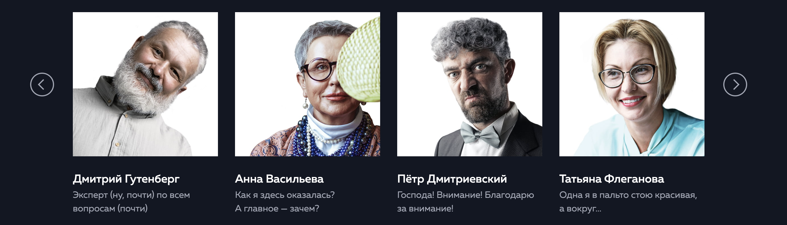
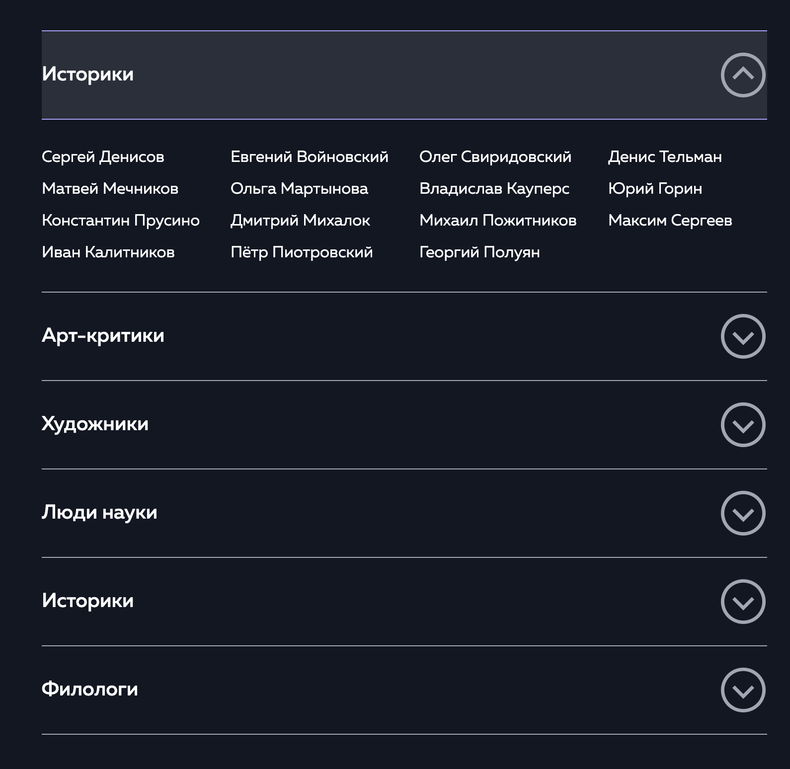
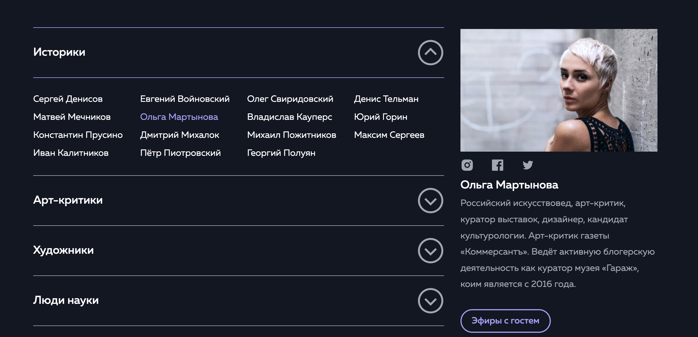
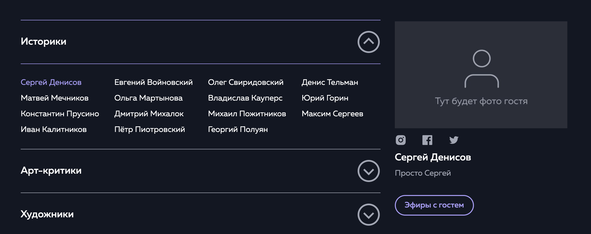

# Лейдинг W-Wave

---

Ссылка на сайт http://wave-w.tmweb.ru/

---

Сайт написан на:
* JS
* HTML
* CSS

## Описание работы

---

### Список задач для выполнения:

1. Сайт должен быть написан без использования фреймворков
2. Реализована кроссбраузерность
3. Адаптив реализован через mobile-first
4. Реализовать валидацию формы
5. Использование название классов по методологии БЭМ
6. Сверстать сайт Pixel Perfect
7. Плавная отработка hover эффектов
8. Реализовать слайдер
9. Реализовать аккардион
10. Использовать дополнительные быблиотеки для отработки сложных элементов (select, scroll)
11. Отображение информации о гостях при нажатие на их имена
---
### Как реализовал?
1. Сайт реализовал на HTML, CSS, JS и дополнительных библиотек для реализации
select, scroll, слайдера
2. Проверял работу сайта в браузерах Opera, Safari, Yandex, Google, Edge, Fire Fox
3. В этот раз решил попробовать реализовать сайт через mobile-first, до этого использовал desktop-first,
что было гораздо проще и удобнее.
4. Валидация формы была реализована через JavaScript, отработал вывод ошибок 
при неверном заполнении.
5. Использование методологии БЭМ облегчает работу для поиска классов в CSS и быстрый 
доступ через JS
6. Проверял сайт через дополнительное разсширение в браузере PerfectPixel by WellDoneCode (pixel perfect)
https://chrome.google.com/webstore/detail/perfectpixel-by-welldonec/dkaagdgjmgdmbnecmcefdhjekcoceebi?hl=ru
7. Реализовал hover, active, focus эффекты
8. Слайдер реализован через библиотеку slick http://kenwheeler.github.io/slick/
   
9. Аккардион сделан через JavaScript
   
10. Для select и scroll я использовал стороние библиотеки, найденые на github
11. Сделал массив объектов для удобного вывода информации о гостях, при нажатии на их имена
    
    

---
## Выводы

---
### Выводы при работе нажд проектом 

* Мне понравилось реализовывать этот проект, сайт получился красивым и выглядит эффектно
* Попробовал сам реализовать аккардион на JS, получилось интересно, в будущем планирую сократь код
* Реализация адаптива черезе mobile-first на практике получилось гораздо удобнее и понятнее,
чем  мною ранее использованный метод decstop-first
* Стороние библиотеки гораздо упрощают работу с реализацией необходимых элементов на сайте
* Понравилось использовать объекты JS для вывода нужной информации, это просто и удобно
* Кроссбраузерность показала мне, что не все сайты одинакого отображаются в разных браузерах,
для этого пришлось использовать обнуление стилей через normalize.css
* Возникла проблема с эффектами hover, focus, active. Пришлось потрудиться для хорошей реализации

---
### Выводы после завершения проекта

Работа над проектом W-Wave была более муторной, чем сложной. Верстать сайты можно научиться быстро,
но всегда найдутся мелочи, которые нужно постоянно корректировать. Больше всего мне понравилось 
писать код на JavaScript, чтобы выполнялись определённые функции при взаимодействии с сайтом.
Проект заметно прокачал меня в вёрстке сайтов. Готов к следующему проекту.
---

